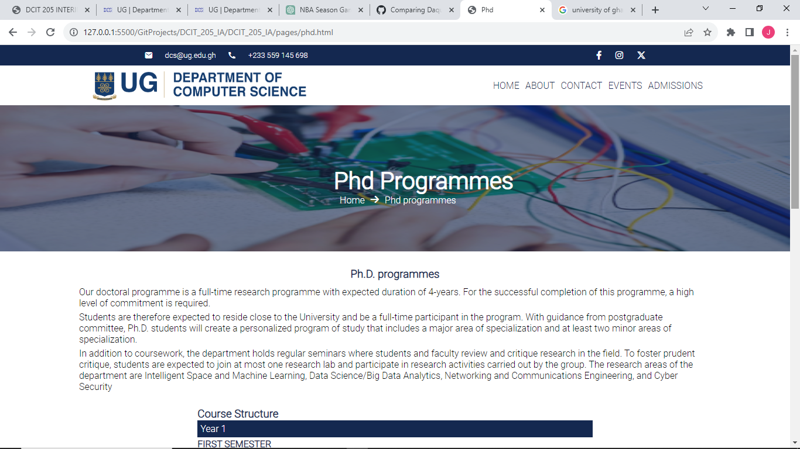

# DCIT_205_IA
## Joshua Andoh-Mensah - 11024515
## Brief introduction and purpose of website
This website is my own version of the ug department of computer science website. I created it using only html, css and javascript. Most of the contents on the website are the same as what you will find on the original department of computer science website with just the design and the layout of the page that has been changed. But still some of the pages are quite similar to the original website.

## How to clone and set up website
To clone a github website you need to fork the github repository first
So you navigate the github repository and click on the fork icon then you follow the steps to fork the repository
Then after you have forked the repsoitory you navigate to the forked repository and click on the code button you will see a link you copy that link 
Then you open your gitbash and navigate to where you want to clone that repository to on your local machine
Then you type git clone https://github.com/NameOfWebsiteYouCloned
And that's it you are done cloning your website
You can also sync your local repo to that of the upstream repo which is the repo you forked
And to do that you navigate to the original repo you forked on github and click on the code button then copy the link there and you open git bash
Then write the command git remote add upstream https://github.com/nameOfOriginalRepo
Then you can use git remote -v to verify if you succesfully synced your local repo to the upstream repo

## Screeenshots of pages of website
## 1. Home page

## 2. Graduate programmes page

## 3. Contact page

## 4. Admissions Page

## 5. Events Page

## 6. Entry Requirements Page

## 7. Short Courses Page

## 8. Phd Programmes Page

## 9. Undergraduate Programmes Page

## 10. About Page

